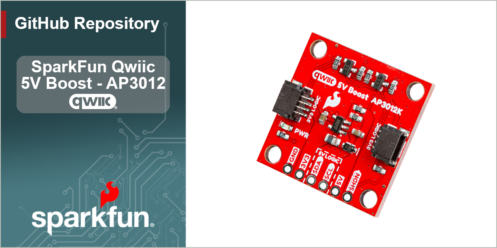

SparkFun Qwiic 5V Boost - AP3012K
========================================

From its Qwiic connectors, the [SparkFun Qwiic 5V Boost - AP3012K](https://https://www.sparkfun.com/sparkfun-qwiic-5v-boost-ap3012k.html) converts the **3.3V** logic-level of the I2C signals and boosts the **3.3V** power supply; all to **5V** on its [PTH *(plated through-hole)*](https://en.wikipedia.org/wiki/Through-hole_technology) pins. This is handy for connecting any I2C device that requires a higher supply voltage for an RGB LED or mechanisms like a DC fan on our air quality sensors:

- [Sensirion SPS30 - Particulate Matter Sensor](https://www.sparkfun.com/particulate-matter-sensor-sps30.html)
- [Sensirion SEN54 - Particle, VOC, Humidity, and Temperature Sensor](https://www.sparkfun.com/particle-voc-humidity-and-temperature-sensor-sen54.html)
- [Sensirion SEN55 - Particle, VOC, NOx, Humidity, and Temperature Sensor](https://www.sparkfun.com/sensirion-particle-voc-humidity-and-temperature-sensor-sen55.html)

On the board, we provide `3V3`/`5V` jumpers, which can be used to configure the logic-levels of the I2C PTH pins. Therefore, this board can be utilized to connect an I2C device that requires any combination of 3.3V/5V for its power and/or signals. Additionally, the [TTL *(transistor–transistor logic)*](https://en.wikipedia.org/wiki/Transistor%E2%80%93transistor_logic) used to convert the logic-levels of the I2C signals can also implemented with other types of interfaces; such as a serial bus, similar to our [SparkFun Logic Level Converter - Single Supply](https://www.sparkfun.com/sparkfun-logic-level-converter-single-supply.html).

> [!WARNING]
> Soldering is required to connect a 5V I2C device to this board.

> [!NOTE]
> The boost circuit on this board is rated to source up to a 100mA at 5V output, with 90% efficiency. However, users should note that this limitation is not only dependent on the load being connected, but also the amount of current that is being sourced to the Qwiic connector system.

Documentation
--------------
- **[Hookup Guide (mkdocs)](http://docs.sparkfun.com/SparkFun_Qwiic_5V_Boost_AP3012K/)** - A hookup guide for the Qwiic 5V Boost - AP3012K, hosted by GitHub pages. 
   

  *Need to download or print our hookup guide?*

  - [Print *(Print to PDF)* from Single-Page View](http://docs.sparkfun.com/SparkFun_Qwiic_5V_Boost_AP3012K/print_view)

Repository Contents
-------------------
- **[/docs](/docs/)** - Online documentation files
    - [/assets](/docs/assets/) - Assets files
        - [/3d_model](/docs/assets/3d_model/) - Files for the 3D models
            - [3D CAD Model](/docs/assets/3d_model/cad_model.step) (.step)
        - [/board_files](/docs/assets/board_files/) - Files for the product design
            - [KiCad Design Files](/docs/assets/board_files/kicad_files.zip) (.zip)
            - [Schematic](/docs/assets/board_files/schematic.pdf) (.pdf)
            - [Dimensions](/docs/assets/board_files/dimensions.pdf) (.pdf)
        - [/component_documentation](/docs/assets/component_documentation/) - Datasheets for hardware components
        - [/img/hookup_guide/](/docs/assets/img/hookup_guide/) - Images for hookup guide documentation
- **[/Hardware](/Hardware/)** - Hardware design files (.brd, .sch)
  - **[/Production](/Production/)** - Production files

Product Variants
----------------
- [PRT-28203](https://www.sparkfun.com/sparkfun-qwiic-5v-boost-ap3012k.html) - Initial Release

Version History
---------------
- [v10](https://github.com/sparkfun/SparkFun_Qwiic_5V_Boost_AP3012K/releases/tag/v10) - Initial Release

License Information
-------------------

This product is ***open source***!

Please review the [`LICENSE.md`](./LICENSE.md) file for license information.

If you have any questions or concerns about licensing, please contact technical support on our [SparkFun forums](https://community.sparkfun.com/).

Distributed as-is; no warranty is given.

- Your friends at SparkFun.
