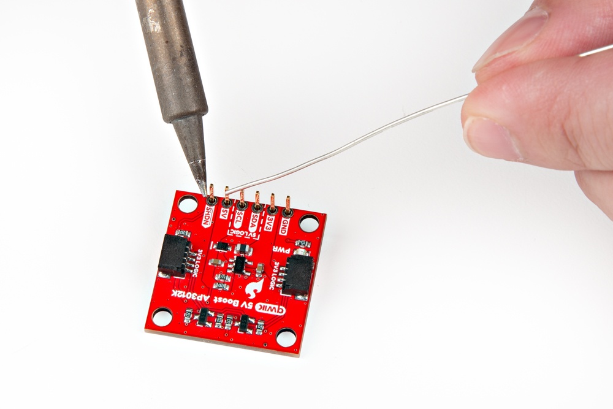
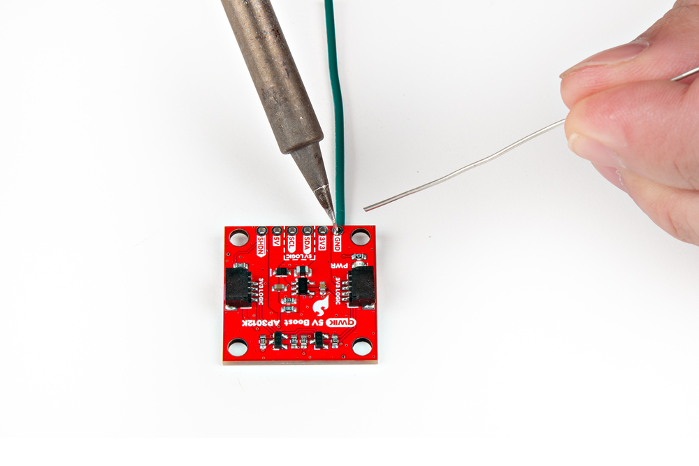
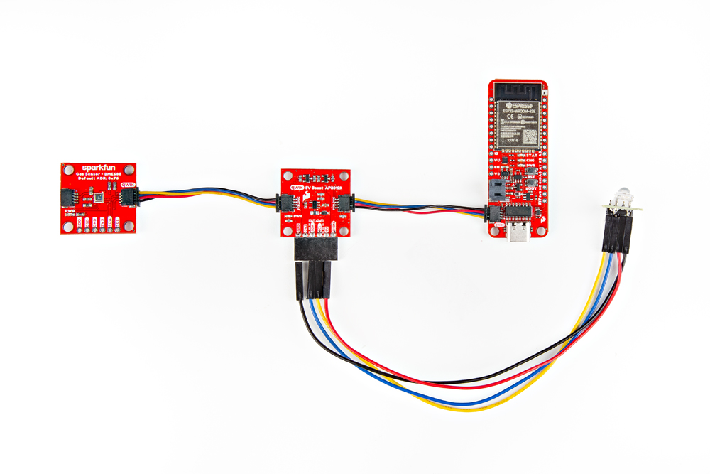

## Breakout Pins
The [PTH](https://en.wikipedia.org/wiki/Through-hole_technology "Plated Through Hole") pins on the Qwiic 5V Boost are broken out into six 0.1"-pitched pins on the edge of the board. These pins are used to connect a 5V I^2^C device to the [Qwiic connect system](hardware_overview.md#qwiic-connectors).

Headers are versatile option testing and development.

<figure markdown>
[{ width="400" }](./assets/img/hookup_guide/assembly-headers.jpg "Click to enlarge")
<figcaption markdown>Soldering headers to the Qwiic 5V Boost.</figcaption>
</figure>

Users can also connect a device directly to the board.

<figure markdown>
[{ width="400" }](./assets/img/hookup_guide/assembly-wires.jpg "Click to enlarge")
<figcaption markdown>Soldering wires to the Qwiic 5V Boost.</figcaption>
</figure>

???+ tip "New to soldering?"
	If you have never soldered before or need a quick refresher, check out our [How to Solder: Through-Hole Soldering](https://learn.sparkfun.com/tutorials/how-to-solder-through-hole-soldering) guide.

	

	-   <a href="https://learn.sparkfun.com/tutorials/5">
		<figure markdown>
		
		</figure>

		---
		
		**How to Solder: Through-Hole Soldering**</a>

	

!!! info "Configuration Options"
	Users will have the following options for connecting a device to the Qwiic 5V Boost:

	<!-- Table of configuration options -->
	--8<-- "./hardware_overview.md:149:166"

	

	

	**Power Supply**

	---

	Use either the `5V` or the `3V3` [PTH](https://en.wikipedia.org/wiki/Through-hole_technology "Plated Through-Hole") pins to supply 5V or 3.3V power to the device.

	

	

	**Logic-Level**

	---

	Users can modify the [`3V3`/`5V` jumpers](./hardware_overview.md#jumpers) to configure the logic-level for the `SDA` and `SCL` [PTH](https://en.wikipedia.org/wiki/Through-hole_technology "Plated Through-Hole") pins.

	*By default, the pins are configured to a 5V logic-level.*

	

	

## Qwiic Connector
The simplest method to connect the Qwiic 5V Boost board to a microcontroller and/or other Qwiic devices, is through the Qwiic connector.

<figure markdown>
[{ width="400" }](./assets/img/hookup_guide/assembly-qwiic.jpg "Click to enlarge")
<figcaption markdown>The Qwiic 5V Boost with a 5V I^2^C RGB LED connected to its PTH pins and daisy-chained with Qwiic cables, though its Qwiic connectors.</figcaption>
</figure>

!!! tip
	The intended design of the Qwiic 5V Boost board was to be utilized with the Qwiic connector system. However, the Qwiic 5V Boost can also be utilized with other interfaces, similar to how the [SparkFun Logic Level Converter - Single Supply](https://www.sparkfun.com/sparkfun-logic-level-converter-single-supply.html) operates. The only difference is its [TTL](https://en.wikipedia.org/wiki/Transistor%E2%80%93transistor_logic "Transistor–Transistor Logic") conversion, which is push-pull and not open-drain.
