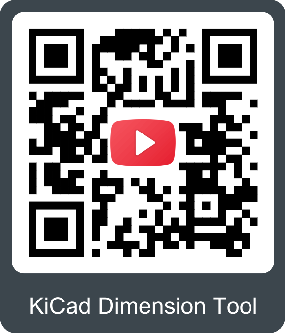

## :material-folder-cog: Design Files

<!-- Import the component -->

-   :kicad-primary:{ .enlarge-logo } Design Files

	---

	- :fontawesome-solid-file-pdf: [Schematic](./assets/board_files/schematic.pdf)
	- :material-folder-zip: [KiCad Files](./assets/board_files/kicad_files.zip)
	- :material-rotate-3d: [STEP File](./assets/3d_model/cad_model.step)
	- :fontawesome-solid-file-pdf: [Board Dimensions](./assets/board_files/dimensions.pdf):
		- 1.00" x 1.00" (25.40mm x 25.40mm)

-   <!-- Boxes in tabs -->

	=== "3D Model"
		

		<model-viewer src="../assets/3d_model/web_model.glb" camera-controls poster="../assets/3d_model/poster.png" tone-mapping="neutral" shadow-intensity="1.7" exposure="0.8" environment-image="legacy" shadow-softness="0.7" camera-orbit="3.797e-14deg 35deg 0.07345m" field-of-view="30deg" style="width: 100%; height: 450px;">
		</model-viewer>

		[Download the `*.step` File](./assets/3d_model/cad_model.step "Click download"){ .md-button .md-button--primary width="250px" }

		

		???+ tip "Manipulate 3D Model"
			

			| Controls       | Mouse                    | Touchscreen    |
			| :------------- | :----------------------: | :------------: |
			| Zoom           | Scroll Wheel             | 2-Finger Pinch |
			| Rotate         | ++"Left-Click"++ & Drag  | 1-Finger Drag  |
			| Move/Translate | ++"Right-Click"++ & Drag | 2-Finger Drag  |

			

	=== "Dimensions"
		

		[{ width="450" }](./assets/board_files/dimensions.png "Click to enlarge")
		<figcaption markdown>
		Dimensions of the Qwiic 5V Boost.
		</figcaption>
		

		???+ tip "Need more measurements?"
			For more information about the board's dimensions, users can download the [KiCad files](./assets/board_files/kicad_files.zip) for this board. These files can be opened in KiCad and additional measurements can be made with the measuring tool.

			!!! info ":octicons-download-16:{ .heart } KiCad - Free Download!"
				KiCad is free, open-source [CAD]("computer-aided design") program for electronics. Click on the button below to download their software. *(\*Users can find out more information about KiCad from their [website](https://www.kicad.org/).)*

				

				[Download :kicad-primary:{ .enlarge-logo }](https://www.kicad.org/download/ "Go to downloads page"){ .md-button .md-button--primary width="250px" }
				

	
			???+ info ":straight_ruler: Measuring Tool"
				This video demonstrates how to utilize the dimensions tool in KiCad, to include additional measurements:

				

				<article class="video-500px">
				<iframe src="https://www.youtube.com/embed/-eXuD8pkCYw" title="KiCad Dimension Tool" frameborder="0" allow="accelerometer; autoplay; clipboard-write; encrypted-media; gyroscope; picture-in-picture" allowfullscreen></iframe>
				</article>
				{ .qr width=200 }
				

## Board Layout

<figure markdown>
[{ width="400" }](./assets/img/hookup_guide/layout.png "Click to enlarge")
<figcaption markdown>Layout of the major components on the Qwiic 5V Boost.</figcaption>
</figure>

The Qwiic 5V Boost has the following features:

1. **[PTH Breakout Pins](#breakout-pins)**
:	A set of six 0.1" pitch [PTH](https://en.wikipedia.org/wiki/Through-hole_technology "Plated Through Hole") pins that breakout the boosted power and converted [TTL](https://en.wikipedia.org/wiki/Transistor%E2%80%93transistor_logic "Transistor–Transistor Logic") signals of the I^2^C bus; and a control pin for the boost converter.
1. **[Qwiic Connectors](#qwiic-connectors)**
:	The primary interfaces for the Qwiic 5V Boost, these are pass-through connectors for the I^2^C bus.
1. **[`PWR` LED](#led)**
:	A red indication LED for when the board is supplied with 3.3V.

## Breakout Pins
The [PTH](https://en.wikipedia.org/wiki/Through-hole_technology "Plated Through Hole") pins of the Qwiic 5V Boost breakout: the 3.3V power supply from the [Qwiic connectors](#qwiic-connectors) that supplies power to the AP3012, the boosted 5V power output from the AP3012, a control pin to disable the AP3012, and the converted 5V, logic-level I^2^C signals from the [Qwiic connectors](#qwiic-connectors).

<figure markdown>
[{ width="400" }](./assets/img/hookup_guide/pins.png "Click to enlarge")
<figcaption markdown>Pin connections between the top and bottom of the Qwiic 5V Boost.</figcaption>
</figure>

`GND`
:	The common ground or the 0V reference for the voltage supplies.

`3V3`
:	The same 3.3V operating power for the Qwiic connectors.

`SDA`/`SCL`
:	The converted [TTL](https://en.wikipedia.org/wiki/Transistor%E2%80%93transistor_logic "Transistor–Transistor Logic") signals of the I^2^C pins from the [Qwiic connectors](#qwiic-connectors); their converted logic-level is controlled by the `3V3`/`5V` [jumpers](#jumpers).

`5V`
:	The boost 5V power output from the AP3012 boost converter, which is rated up to ~100mA load.

`SHDN`
:	The control signal for AP3012 boost converter; pull `LOW` to disable the IC.

!!! info "I/O Configurations"
	With the [`3V3`/`5V` jumpers](#jumpers) to configure the logic-levels of the I^2^C [PTH](https://en.wikipedia.org/wiki/Through-hole_technology "Plated Through Hole") pins, users can convert the power and logic-levels of the Qwiic connector to any combination of 3.3V and/or 5V on the PTH pins:

	

	<table markdown>
	<tr>
	<th>Output Power</th>
	<td>5V</td>
	<td>5V</td>
	<td>3.3V</td>
	</tr>
	<tr markdown>
	<th markdown>I^2^C Logic-Level</th>
	<td>3.3V</td>
	<td>5V</td>
	<td>5V</td>
	</tr>
	</table>

	

	*By default, the pins are configured to a 5V logic-level.*

???+ danger "Maximum Load Current"
	We recommend a maximum load current of ~100mA from the `5V` output supply voltage from the AP3012 boost converter.

	The boosted supply voltage of the boost converter will begin to drop as the current draw from the load increases. We found that for a boosted 5V output from a 3.3V input voltage, there is an inflection point around **100mA** where the boosted voltage begins to drop off significantly.

	

	| Load Current | Boosted Voltage |
	| :----------: | :-------------: |
	| 10mA | 4.92V |
	| 20mA | 4.91V |
	| 75mA | 4.90V |
	| 100mA | 4.89V |
	| 150mA | 4.87V |
	| 200mA | 4.65V |

	

	!!! info
		This limitation is driven by the current load and supply current for the Qwiic connect system. It is not dictated by the junction temperature of the AP3012.

## Qwiic Connectors
Qwiic connectors are provided for users to seamlessly integrate with [SparkFun's Qwiic Ecosystem](https://www.sparkfun.com/qwiic). These are pass-through connectors that operate at the standard 3.3V operating voltage and logic-levels.

<figure markdown>
[{ width="400" }](./assets/img/hookup_guide/qwiic_connectors.png "Click to enlarge")
<figcaption markdown>Qwiic connectors on the Qwiic 5V Boost.</figcaption>
</figure>

???+ tip "What is Qwiic?"

	

	

	<!-- Qwiic Banner -->
	

	[{ width=400 }](https://www.sparkfun.com/qwiic)
	[{ width=400 }](https://www.sparkfun.com/qwiic)
	

	---

	The [Qwiic connect system](https://www.sparkfun.com/qwiic) is a solderless, polarized connection system that allows users to seamlessly daisy chain I^2^C boards together. Play the video, to learn more about the Qwiic connect system or click on the banner above to learn more about [Qwiic products](https://www.sparkfun.com/qwiic).

	

	

	

	

	<iframe src="https://www.youtube.com/embed/x0RDEHqFIF8" title="SparkFun's Qwiic Connect System" frameborder="0" allow="accelerometer; encrypted-media; gyroscope; picture-in-picture" allowfullscreen></iframe>
	

	{ .qr width=200 }
	

	

	

	!!! info "Features of the Qwiic System"

		=== "No Soldering"

			{ align="left" width="90" }
			{ align="left" width="90" }

			Qwiic cables (4-pin JST) plug easily from development boards to sensors, shields, accessory boards and more, making easy work of setting up a new prototype.

		=== "Polarized Connector"

			{ align="left" width="90" }
			{ align="left" width="90" }

			There's no need to worry about accidentally swapping the `SDA` and `SCL` wires on your breadboard. The Qwiic connector is polarized so you know you’ll have it wired correctly every time.

			The part numbers for the PCB connector is `SM04B-SRSS` ([Datasheet](https://cdn.sparkfun.com/assets/parts/1/2/2/8/9/Qwiic_Connector_Datasheet.pdf)) and the mating connector on the cables is `SHR04V-S-B`; or an equivalent *1mm pitch, 4-pin JST connection*.

		=== "Daisy Chain-able"

			{ align="left" width="90" }
			{ align="left" width="90" }

			It’s time to leverage the power of the I^2^C bus! Most Qwiic boards will have two or more connectors on them, allowing multiple devices to be connected.

## LED
There is a red `PWR` LED to indicate when the Qwiic 5V Boost is powered with 3.3V. The LED can be disabled by cutting the `LED` [jumper](#jumpers).

<figure markdown>
[{ width="400" }](./assets/img/hookup_guide/LEDs.png "Click to enlarge")
<figcaption markdown>The red `PWR` LED the Qwiic 5V Boost.</figcaption>
</figure>

## Jumpers
There are four jumpers on the back of the board that can be used to easily modify the hardware connections on the board.

<figure markdown>
[{ width="400" }](./assets/img/hookup_guide/jumpers.png "Click to enlarge")
<figcaption markdown>The jumpers on the top of the Qwiic 5V Boost.</figcaption>
</figure>

`I2C`
:	This jumper can be cut to disconnect the pull-up resistors from the I^2^C pins of Qwiic connectors.

`I2C HV`
:	This jumper can be cut to disconnect the pull-up resistors from the I^2^C pins of [PTH](https://en.wikipedia.org/wiki/Through-hole_technology "Plated Through Hole") breakout pins.

`LED`
:	This jumper can be cut to remove power from the red `PWR` LED.

`3V3`/`5V`
:	Configures the [TTL](https://en.wikipedia.org/wiki/Transistor%E2%80%93transistor_logic "Transistor–Transistor Logic") signal level for the I^2^C pins of [PTH](https://en.wikipedia.org/wiki/Through-hole_technology "Plated Through Hole") breakout pins to either **5V** or **3.3V**.

???+ note "Never modified a jumper before?"
	Check out our <a href="https://learn.sparkfun.com/tutorials/664">Jumper Pads and PCB Traces tutorial</a> for a quick introduction!

	<article class="grid cards" markdown align="center">

	-   <a href="https://learn.sparkfun.com/tutorials/664">
		<figure markdown>
		
		</figure>

		---

		**How to Work with Jumper Pads and PCB Traces**</a>

	</article>
