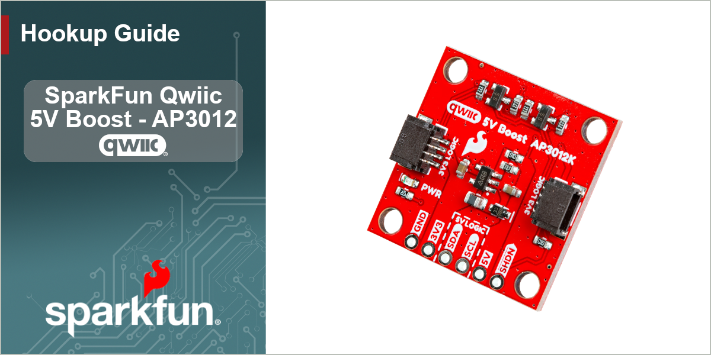

<figure markdown>

</figure>

---

# Introduction

The SparkFun Qwiic 5V Boost - AP3012K converts the logic-level and boost the power of the Qwiic connect system from **3.3V**, to **5V** on its [PTH](https://en.wikipedia.org/wiki/Through-hole_technology "Plated Through-Hole") pins. This is handy for connecting any I2C device that requires a higher supply voltage, such as super bright LEDs or mechanisms like a DC fan on our air quality sensors. On the board, we also provide `3V3`/`5V` jumpers, which can be used to configure the logic-levels of the I2C PTH pins. Therefore, this board can be utilized to connect an I2C device that requires any combination of 3.3V/5V for its power and/or signals.

???+ note
	The boost circuit on this board is rated to source up to a 100mA at 5V output, with 90% efficiency. However, users should note that this limitation is not only dependent on the load being connected, but also the amount of current that is being sourced to the Qwiic connector system.

---

In this guide we'll cover how to utilize the Qwiic 5V Boost with two 5V I^2^C devices; such as the [BlinkM LED](https://www.sparkfun.com/blinkm-i2c-controlled-rgb-led.html) and [Sensirion SEN55 sensor](https://www.sparkfun.com/sensirion-particle-voc-humidity-and-temperature-sensor-sen55.html). To follow along with this tutorial, users will need the following items:

- [Thing Plus Development Board](https://www.sparkfun.com/thing-plus)
	- We recommend either the [ESP32 Thing Plus](https://www.sparkfun.com/sparkfun-thing-plus-esp32-wroom-usb-c.html) or the [RP2350 Thing Plus](https://www.sparkfun.com/sparkfun-thing-plus-rp2350.html)
- [SparkFun Qwiic 5V Boost - AP3012K](https://www.sparkfun.com/sparkfun-qwiic-5v-boost-ap3012k.html)
- [SparkFun Qwiic Cable Kit](https://www.sparkfun.com/sparkfun-qwiic-cable-kit.html)
- A 5V compatible I^2^C device:
	- [BlinkM - I2C Controlled RGB LED](https://www.sparkfun.com/blinkm-i2c-controlled-rgb-led.html)
	- [Sensirion SEN55 - Particle, VOC, NO~x~, Humidity, and Temperature Sensor](https://www.sparkfun.com/sensirion-particle-voc-humidity-and-temperature-sensor-sen55.html)
- Soldering tools
- Headers and jumper Wire
- USB cable

???+ warning
	Soldering is required for this board.

???+ tip
	The particulate matter sensor requires an extra `GND` connection to enable the I^2^C interface.

???+ note
	These other Sensirion particulate matter sensors, may also be used in place of the SEN55:

	- [Sensirion SPS30 - Particulate Matter Sensor](https://www.sparkfun.com/particulate-matter-sensor-sps30.html)
	- [Sensirion SEN54 - Particle, VOC, Humidity, and Temperature Sensor](https://www.sparkfun.com/particle-voc-humidity-and-temperature-sensor-sen54.html)

## Topics
This document contains two main sections: **Quickstart Guide** and **Hardware** sub-sections.

- The **Quickstart Guide** assumes a working knowledge of development boards and the required software to program them for your project's needs. It covers the basic hardware information and assembly instructions users would need to get started with this product.
- The **Hardware** sections provide:
	- An overview of the Qwiic 5V Boost - AP3012K board and its major components. Refer to this page for information on the connectors, breakout pins, and jumpers.
	- Assembly instructions to utilize this product with compatible 5V I^2^C devices.

## Resources and Support
You'll find the board design files (KiCad files & schematic), relevant documentation (datasheets, white papers, etc.) and other helpful links on the [Resources page](./resources.md). Lastly, the **Support** section includes a [Troubleshooting page](./troubleshooting_tips.md) that includes any helpful tips specific to this board as well as information on how to receive technical support from SparkFun.
