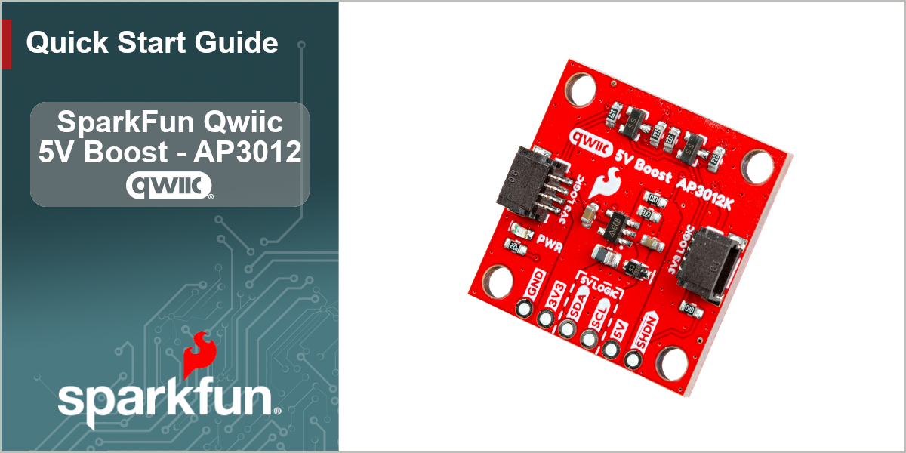
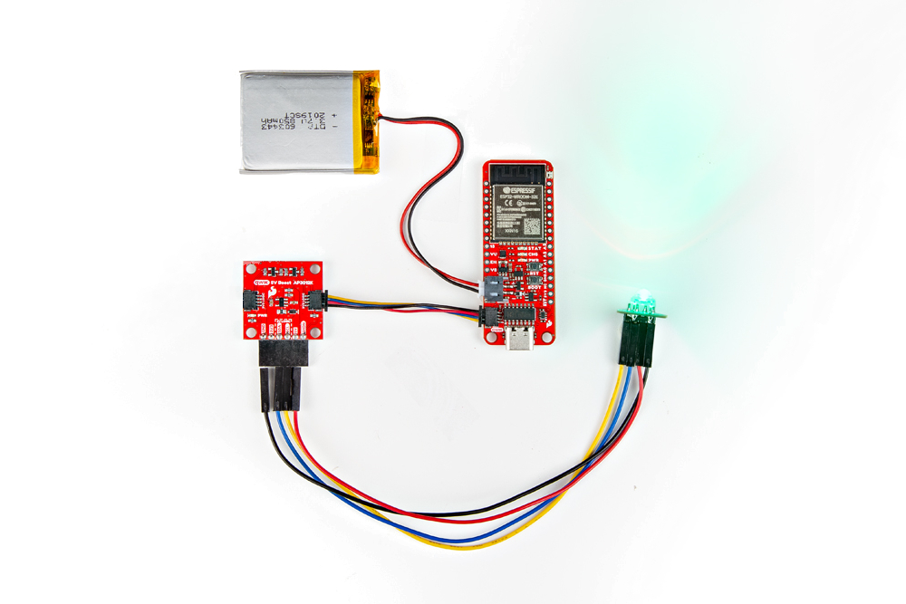
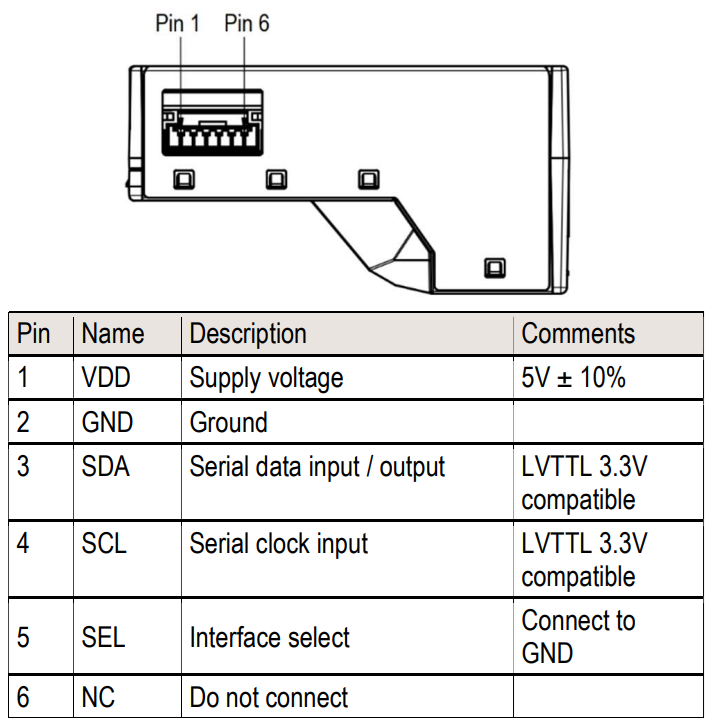
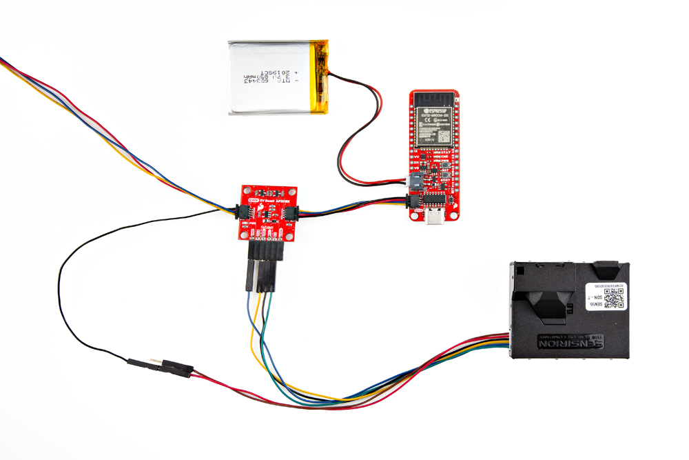

<figure markdown>

</figure>

---

--8<-- "./introduction.md:19:34"


## Board Layout
This is the basic layout of the Qwiic 5V Boost board.

<!-- Board Layout -->
--8<-- "hardware_overview.md:83:86"


## Demo - BlinkM LED
In this demo, we'll connect a BlinkM RGB LED to the Qwiic 5V Boost board; and control it with an ESP32 Thing Plus development board, utilizing the Arduino IDE.


### Connect the BlinkM LED
Soldering is required to connect the BlinkM LED to the Qwiic 5V Boost board. In the example below, we used headers and jumper wires to make the necessary pin connections shown in the table. Once the BlinkM LED is attached, users will need to connect the Qwiic 5V Boost board to their development board with a Qwiic cable.


<div class="grid" markdown>

<div markdown align="center">

| Qwiic 5V Boost | BlinkM RGB LED |
| :------------: | :------------: |
| `GND` | `-` |
| `5V`  | `+` |
| `SDA` | `d` |
| `SCL` | `c` |

</div>


<div markdown>

<figure markdown>
[{ width="400" }](./assets/img/hookup_guide/demo-blinkm.jpg "Click to enlarge")
<figcaption markdown>Connecting the BlinkM LED to the Qwiic 5V Boost.</figcaption>
</figure>

</div>

</div>


???+ tip
	If you're not familiar with using breakout board or soldering, please refer to the Hardware [Overview](./hardware_overview.md) & [Assembly](./hardware_assembly.md) sections for a detailed overview of the board along with instructions on soldering to the breakout.


### Example Code
With the hardware assembled, users will need to program their development board to control the BlinkM LED. In the Arduino IDE, upload the [`BlinkMStart` example](https://github.com/todbot/BlinkM-Arduino/blob/main/examples/BlinkMStart/BlinkMStart.ino) sketch from the [BlinkM Arduino library](https://github.com/todbot/BlinkM-Arduino). This example will fade the hue of the BlinkM LED and output the hue values to the Serial Monitor.


Follow the steps below to upload the example code:

- Open the [Arduino IDE](https://docs.arduino.cc/software/ide-v2/tutorials/getting-started-ide-v2/).
- Manually install the BlinkM Arduino library, by downloading it from the [GitHub repository](https://github.com/todbot/BlinkM-Arduino).
- Restart the Arduino IDE.
- Open `BlinkMStart` example sketch from the BlinkM Arduino library.
- Select your board and serial port; then, upload the sketch.
- Once the code compiles and uploads to the development board, open the [serial monitor](https://docs.arduino.cc/software/ide-v2/tutorials/ide-v2-serial-monitor/) with the baud rate set to **9600** bps.
- The example sketch prints out the hue values as they change on the BlinkM LED.


???+ tip
	If you're not familiar with using the Arduino IDE, refer to the [Troubleshooting Tips](./troubleshooting_tips.md) section for related tutorials.


!!! tip "LED Not Changing"
	For users who find it hard to distinguish the changes in the LED's hue, the sketch can be modified to change the RGB values. Below, is an example of modifications that would change the `red` value of the RGB LED.

	???+ code "Modifications"

		```cpp linenums="15" hl_lines="1"
		byte red=0;
		```	
		```cpp linenums="36" hl_lines="3 5 7"
		void loop() 
		{
		    red += 10; // random(0,255);
		    Serial.print("Fading to hue ");
		    Serial.println(red);
		
		    blinkm.fadeToRGB( red, 255, 255);
		
		    delay(500);
		}
		```


#### Source Files

- [BlinkM Arduino library](https://github.com/todbot/BlinkM-Arduino)
- [`BlinkMStart.ino` example sketch](https://github.com/todbot/BlinkM-Arduino/blob/main/examples/BlinkMStart/BlinkMStart.ino)

	???+ code "BlinkMStart.ino"
		```cpp linenums="1"
		--8<-- "https://github.com/todbot/BlinkM-Arduino/raw/refs/heads/main/examples/BlinkMStart/BlinkMStart.ino"
		```


## Demo - SEN55 Particle Sensor
In this demo, we'll connect the Sensirion SEN55 particulate matter, VOC, NO~x~, humidity, and temperature sensor to the Qwiic 5V Boost board; and read data from it with an ESP32 Thing Plus development board, utilizing the Arduino IDE.


### Connect the Sensirion SEN55 Sensor
Soldering is required to connect the SEN55 sensor to the Qwiic 5V Boost board. In the example below, we used headers and a Qwiic jumper cable to make the necessary pin connections shown in the tables.


<div class="grid" markdown>

<div markdown align="center">

| Qwiic 5V Boost | Sensirion SEN55 Sensor |
| :------------: | :------------: |
| `GND` | `2` |
| `5V`  | `1` |
| `SDA` | `3` |
| `SCL` | `4` |
| `GND` | `5` |

</div>


<div markdown>

<figure markdown>
[{ width="280" }](./assets/img/hookup_guide/pins-sen5x.png "Click to enlarge")
<figcaption markdown>Hardware pins for the Sensirion SEN55 sensor.</figcaption>
</figure>

</div>

</div>


Once the sensor is attached, users will need to connect the Qwiic 5V Boost board to their development board with a Qwiic cable.


<figure markdown>
[{ width="400" }](./assets/img/hookup_guide/demo-sen55.jpg "Click to enlarge")
<figcaption markdown>Connecting the Sensirion SEN55 sensor to the Qwiic 5V Boost.</figcaption>
</figure>


???+ tip
	If you're not familiar with using breakout board or soldering, please refer to the Hardware [Overview](./hardware_overview.md) & [Assembly](./hardware_assembly.md) sections for a detailed overview of the board along with instructions on soldering to the breakout.


### Example Code
With the hardware assembled, users will need to program their development board to retrieve data from the SEN5X sensor. In the Arduino IDE, upload the [`exampleUsage` example](https://github.com/Sensirion/arduino-i2c-sen5x/blob/master/examples/exampleUsage/exampleUsage.ino) sketch from the [Sensirion I2C SEN5X Arduino library](https://github.com/Sensirion/arduino-i2c-sen5x). This example will read the particulate matter, VOC, NO~x~, humidity, and temperature values from the SEN5X sensor and output them in the Serial Monitor.


Follow the steps below to upload the example code:

- Open the [Arduino IDE](https://docs.arduino.cc/software/ide-v2/tutorials/getting-started-ide-v2/).
- Open the [Library Manager](https://docs.arduino.cc/software/ide-v2/tutorials/ide-v2-installing-a-library/) tool, search for the `Sensirion I2C SEN5X` Arduino library and install the latest version.
- Open `exampleUsage` example sketch from the Sensirion I2C SEN5X Arduino library.
- Select your board and serial port; then, upload the sketch.
- Once the code compiles and uploads to the development board, open the [serial monitor](https://docs.arduino.cc/software/ide-v2/tutorials/ide-v2-serial-monitor/) with the baud rate set to **115200** bps.
- The example sketch prints out the particulate matter, VOC, NO~x~, humidity, and temperature values from the SEN55 sensor.


???+ tip
	If you're not familiar with using the Arduino IDE, refer to the [Troubleshooting Tips](./troubleshooting_tips.md) section for related tutorials.


#### Source Files

- [Sensirion SEN5X Arduino library](https://github.com/Sensirion/arduino-i2c-sen5x)
- [`exampleUsage.ino` example sketch](https://github.com/Sensirion/arduino-i2c-sen5x/blob/master/examples/exampleUsage/exampleUsage.ino)

	???+ code "exampleUsage.ino"
		```cpp linenums="1"
		--8<-- "https://github.com/Sensirion/arduino-i2c-sen5x/raw/refs/heads/master/examples/exampleUsage/exampleUsage.ino"
		```
